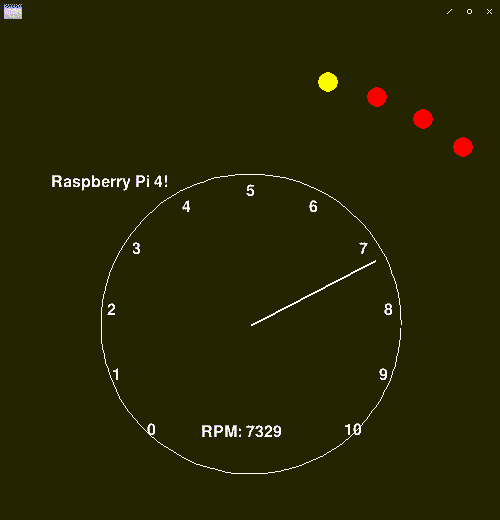

# Racing simulator rig

Try to make a racing rig, with real analog instruments, and a Raspberry Pi 4 with an LCD to show telemetry data.

## Goals
- Build frame using wood
- [Fanatec](https://fanatec.com/)
	- [ClubSport Wheel Base](https://fanatec.com/eu-en/racing-wheels-wheel-bases/wheel-bases/clubsport-wheel-base-v2.5)
	- [Pedals](https://fanatec.com/eu-en/pedals/clubsport-pedals-v3)
- Custom handbrake in wood (analog)
	- To replicate the placement in the Hoonicorn and use custom springs inside it to make it heavy
- Custom shifter, digital (up and down)
	- To replicate the placement in the Hoonicorn 
- [Real Sparco seat!](https://www.sparco-official.com/en/racing/seats-and-belts/tubular-seats/sed-sprint-2019-az.html)
- Windows-based PC, mainly using:
	- Project Cars 2
	- iRacing
- [Real, analog instruments](https://www.autometer.com/gauges/hoonigan.html)
	- RPM
	- Temperature
	- Fuel level
- Mockup "MoTec" LCD display unit
	- Shows tire wear and current gear (R, N, 1, 2, 3, 4, 5...)
	- Powerful leds lighting up when car engine get close to redline
	- Raspberry Pi 4
	- 5" LCD touch display
	- Customized Linux OS that only shows 1 window (no OS controls by default)
	- Python3 + Pygame for Graphics
	- Receives telemetry data via UDP (ethernet)
- One single power-on switch for everything
	- Turns on lights, the gauges (RPM, temp, fuel) and the Raspberry Pi 4 "MowTec"
	- Wakes up Windows PC from sleep, that is hopefully inside a racing game, ready for use
		- Turns on all the 3 screens automatically
	- Turn on any power to the Fanatec equipment, if it can be turned off while the PC is in standby(?)

## The "MowTec"
This is the device that mocks a MoTec display. These usually have a small LCD-screen with some LEDs above lighting up when engine RPM is close to redline.

Inspired from the Ken Block's Hoonitruck, where the LEDs look like a christmas tree when he redlines his vehicle.

Test-implementation done with Pygame. Unsure if the LEDs should be on/off, or if a better option would be to pulse width modulate them.
